# Biblioteca

_By Aja Magdaleno, Cecilia Kim, James Rodgick, and Armando Pensado_

## Description

The application is a pretend Library system, made using Node JS, MySQL, sequlize (ORM). The applications include models, API routes, HTML routes, and a public folder for what the user will see in the internet browser.

The application offers functionality where the user can manage library sections (shelfs) where the books will be stored, functionality to manage the library inventory, and a frontend for the user to search for books base on title, author, year, genre, and ISBN.

Additionally, as user borrows book, through the online checkout, the quantity in the inventory is affected, and also the usage totals an increased. The later are used to build a chart, that provides a graphical representation of user’s preferences.

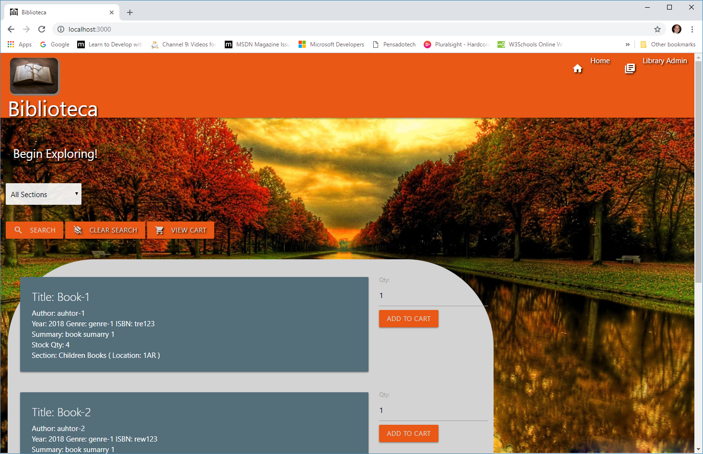

## How does it works

The application works with MySQL database, and at the start, the library system will be empty, and the user, using the “LibraryAdmin” option in the menu must go to the “Library Sections” and add several sections, to stablish, lets say, the shelfs where the books will be stored. 

After that, using the same Administration functionality, the user must got to “Books Inventory” and add books available at the library. 

### Library Administration

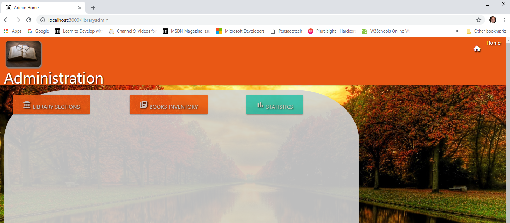

### Library Section Managment

The library sections are defined with a section description and a location. 

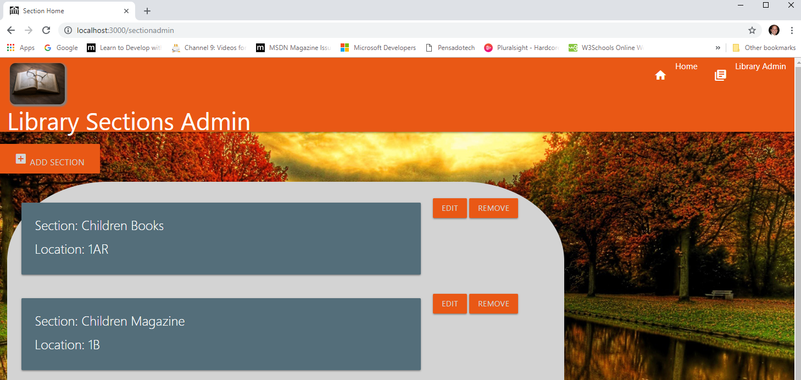

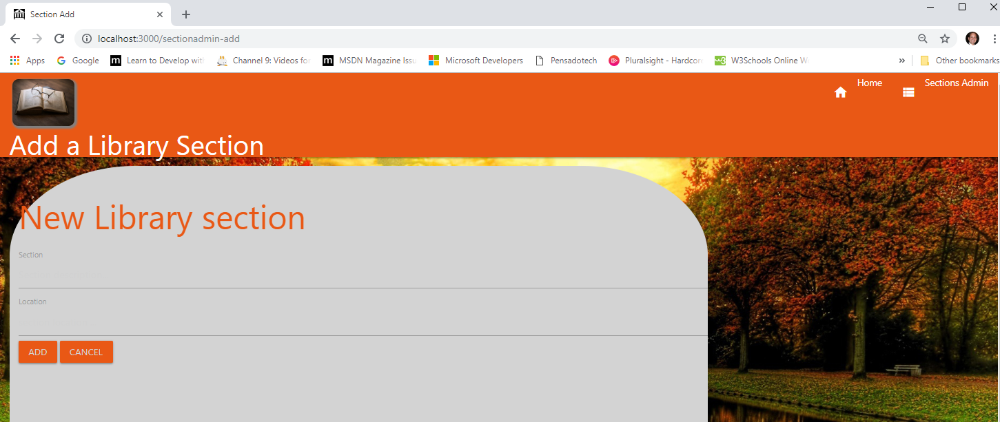

### Library Book Management (Inventory)

The books will be associated with a Library section (location), and requires a Title, Author, Year, Genre, ISBN, summary, and the total quantity of books available in the library.

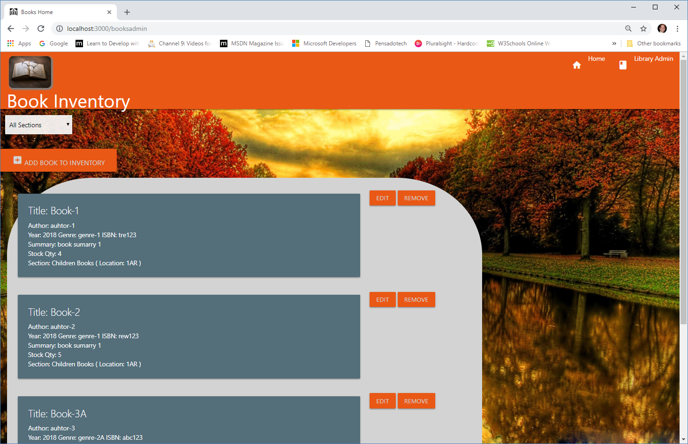

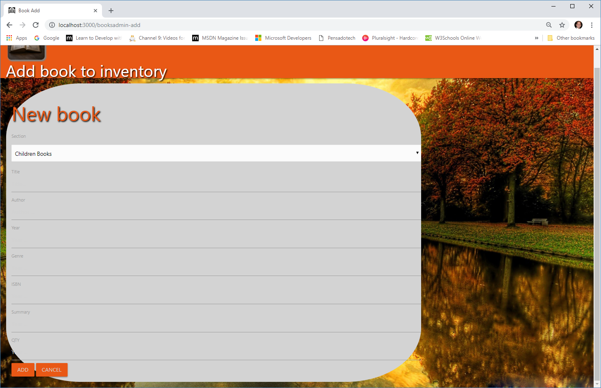


### Library frontend

After the library sections and books are incorporated into the system, the frontend will start presenting books cards with the provide information. 

The first approach is for the user to use the library section filter (dropdown selector) to start narrowing possible options.


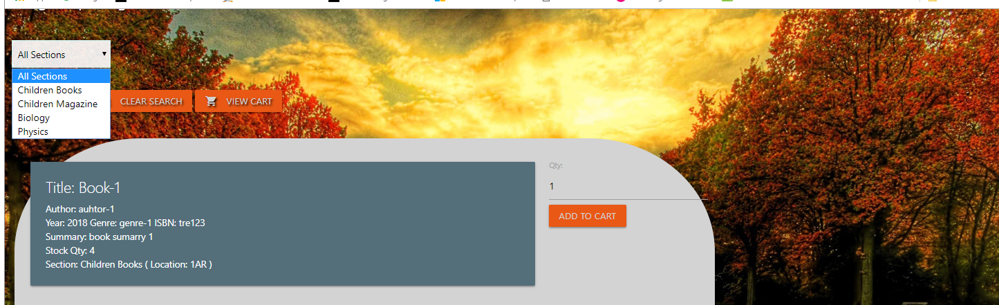

Additionally, the user can utilize the search functionality. The system will provide a space where to enter key information that will bring into the frontend the results for the books.

The user can use the “Clear Search” to return to the initial state of the page.

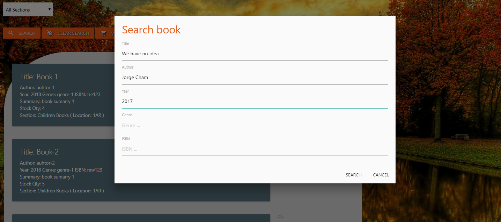


### Library books checkout

As a continuation of the pretend exercise, and a way to signal that the books are taken home by the users, the application offers in the front end a library cart. The user can select the books and the quantity, and by hitting “Add to Cart”, the system will incorporate the books to the cart.

The user will receive immediate feedback of how many books are in the cart, and by selecting the “View Cart” option in the screen, the user will navigate into the cart and see the list of books to take home.

The user can change her/his mind and remove items from the cart, or clear the whole cart.  

Selecting the “Checkout” option, the system will reduce the quantities from the inventory and add the total usage count for statistical purposes.

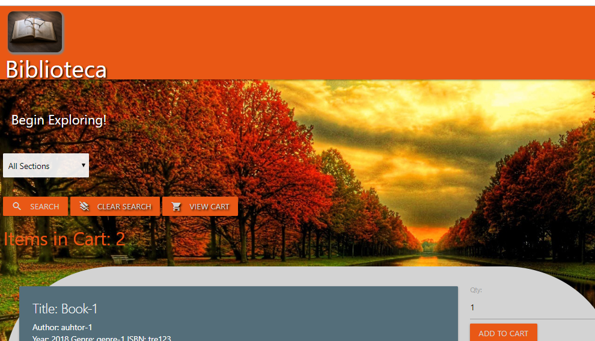

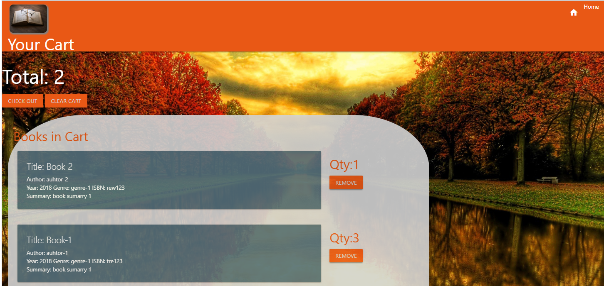

### Library usage charts

Base on the user activity, checking out books, the total usage number per books are affected. 

From the Library admin option, the user can select the “Statistics” button and a page will be presented with four options that can be used to target the use of the books by Title, Author, Genre, and/or Year.

The option can be left empty, and use the “Find All” button to bring the charts.
If any of the key information is provided, the user by using the “Search” button will bring the chart for the specific keys.


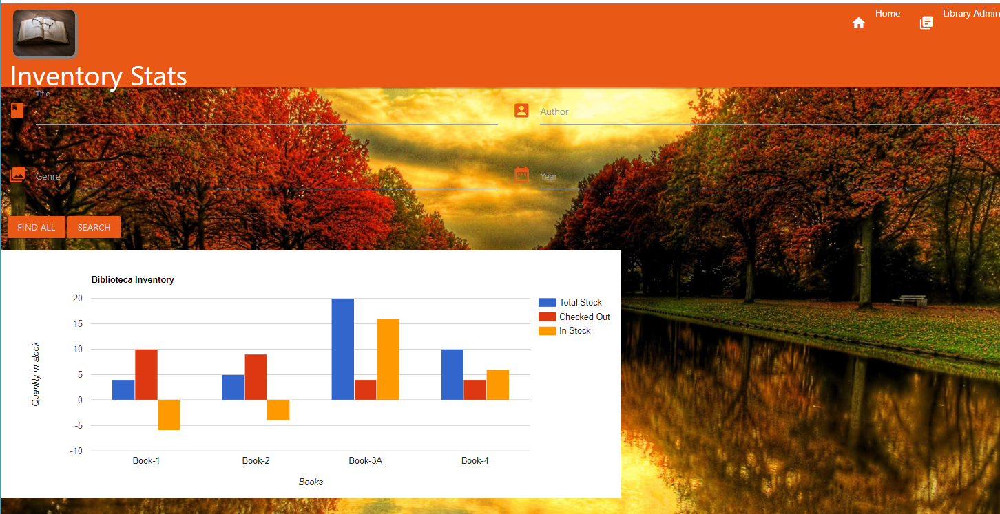


## Who can benefit from this application

This application is beneficial for NodeJS developer, providing sample programming structures using JavaScript, and using **Express**, **MySql**, **seqelize (ORM)**, and API routes that encapsulate the logic to access the database.

## How developers can get started

To start, the developer must have NodeJS installed in the computer. After, that the project can be cloned and initialized.  Here are the steps for getting started.

1. Install MySql in your local computer, or have one remote MySql datbase available.

2. Install NodeJS into the computer  (https://nodejs.org/en/). Download button and run through the installation file.

3. Clone or Fork the project into the computer.

4. In the folder project, Make a `.gitignore` file using https://www.gitignore.io/, selecting the key words for the OS, node, and visual code (e.g. Windows, visual code, node). This will tell git not to track these files specified in the contents, and thus they won't be committed to Github.

5. Bring all external module dependencies using the command:

```js
npm i
```

After, the initialization, and using Microsoft Visual Code, the project folder should resemble as depicted below, and should be ready for execution.

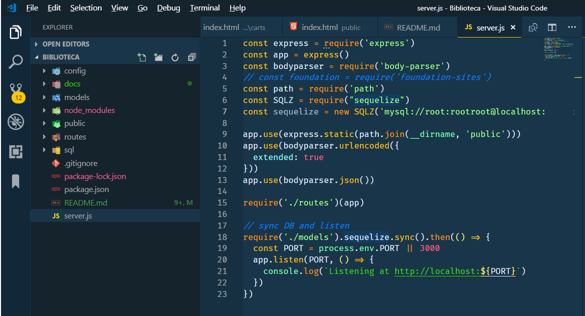

6. It is necesary to add a folder "config" and inside a "config.json" file. This will have a structure as depicted bellow. 

* For the database use "biblioteca_db".
* For a local MySql database use "127.0.0.1"

```js
{
  "development": {
    "username": "<your-ID>",
    "password": "<your-pwd>",
    "database": "<database-name>",
    "host": "<your-server>",
    "port": "<tcp port>",
    "dialect": "mysql"
  },
  "test": {
    "username": "<your-ID>",
    "password": "<your-pwd>",
    "database":  "<database-name>",
    "host": "127.0.0.1",
    "port": "<tcp port>",
    "dialect": "mysql"
  },
  "production": {
    "username": "<your-ID>",
    "password": "<your-pwd>",
    "database": "<database-name>",
    "host": "<your-server>",
    "port": "<tcp port>",
    "dialect": "mysql"
  }
}

```

The project offers a SQl file "biblioteca.sql" that offer code to create the database the first time. This must be done form the MySQL Workbench. Execute the following commands.


```sql
-- remove databases if exists
DROP DATABASE IF EXISTS biblioteca_db;
-- create the table
CREATE DATABASE biblioteca_db;
```

once the databse is setup, launch the server, using one of the two following commands. That last one is in case the NODEMON nmp was installed (_npm install -g nodemon_).

```js

node server.js

or

nodemon

```

## Who maintains and contributes to the project

This is a team project based on UCI Bootcamp training. 


## Where users can get help with the project

The developer can refer to the following links:


* MySql    : https://www.mysql.com/
* NodeJs   : https://nodejs.org/en/
* Express  : https://www.npmjs.com/package/express
* sequelize : https://www.npmjs.com/package/sequelize
* sequelize Docs : http://docs.sequelizejs.com/manual/installation/getting-started.html

